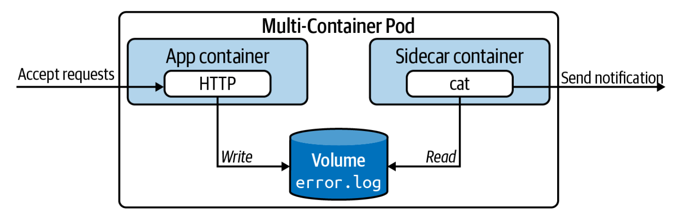

# multicontainerpod

Kubernetes'teki bir Pod'un birden fazla container içerdiği anlamına gelir. Birden fazla container'ın aynı pod içerisinde çalışmasını sağlar ve bu containerlar genellikle birbirleriyle işbirliği yapar.


 
1-) Aynı pod içinde tanımlanmış tüm containerlar aynı worker node üzerinde oluşturulur.

2-) Containerlar ayrı birer ünitedir. Ancak podun life cycle'ı içinde yönetilir. Yani pod oluşturulduğunda 2 container aynı anda oluşturulur , silinirse aynı anda silinir.

3-) Containerlar arasında network izolasyonu bulunmaz. Yani aynı pod içindeki containerlar localhost üzerinden birbirlerine ulaşabilirler.

4-) Tek volume oluşturularak ikisine de mount edilir.

### Komutlar
* ```kubectl apply -f pod.yaml```
* ```kubectl get pod -w```
* ```kubectl exec -it multicontainer -c webcontainer -- /bin/sh```
* ```kubectl port-forward pod/multicontainer 8081:80```
